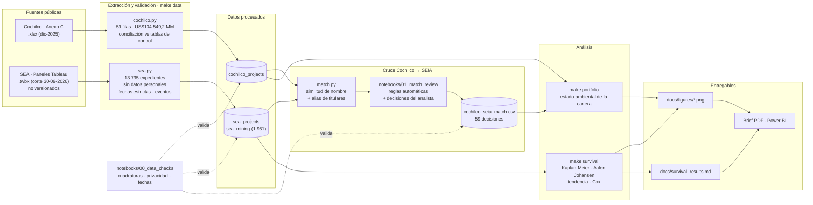
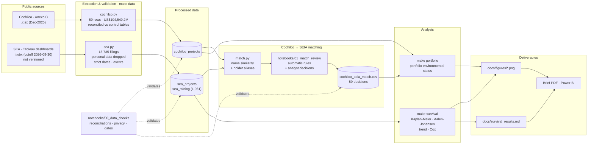

# Chile Mining Investment Pipeline

## Idiomas / Languages

- [Español](#español)
- [English](#english)

---

## Español

CMIP convierte la cartera de inversión minera de Cochilco de diciembre de 2025
en datos reproducibles para analizar proyectos previstos para 2025–2034 y su
tramitación ambiental en el SEA.

### Hallazgos

**20,9% de la inversión minera 2025–2034 no tiene expediente SEIA
identificado:** 21.893,9 MMUS$ en 8 proyectos, todos en etapa de estudio.

- La aprobación acumulada Aalen–Johansen de EIA es **31,7% a 24 meses** y
  **51,7% a 36 meses**.
- Para EIA ≥100 MMUS$, la aprobación Aalen–Johansen a 24 meses tiene un
  **IC bootstrap por familia de reingreso de 27,6%–52,0%** (estimación central:
  39,6%; 2.000 réplicas, semilla 20261002).
- La inversión actualmente en evaluación alcanza **24.780 MMUS$ en 15
  proyectos**.
- La inversión con RCA favorable suma **32.746,4 MMUS$**, o **31,3%** de la
  cartera.

Sensibilidades fuera del PDF (DIA / EIA, respectivamente):

| Población | n | Aprobación AJ a 24 meses |
|---|---:|---:|
| Principal, sin tipologías `i5*` | 1.002 / 124 | 70,2% / 31,7% |
| Con áridos y registros no mineros `i5*` | 1.515 / 130 | 66,5% / 31,3% |
| Sin desistimientos a 60 días o menos | 878 / 112 | 80,2% / 35,2% |
| Reingresos deduplicados | 882 / 107 | 76,6% / 32,8% |

Briefs ejecutivos: [español](docs/brief/brief_c1_es.pdf) ·
[English](docs/brief/brief_c1_en.pdf).

#### Validación

La compuerta de publicación exige que cada cifra esté en el registro de
`build_claims_register()` con estado `verificada` y un recálculo independiente.
El checklist conserva sus 40 filas respondidas y agrega 21 asignaciones
automáticas pendientes. Por ello, 38 de 59 cruces están revisados ficha por
ficha y la compuerta de publicación permanece cerrada hasta que J responda las
21 filas nuevas. `make brief-draft` genera PDF con marca de agua para revisar el
diseño; `make brief` falla mientras exista una respuesta vacía. Cuando J use
`confirmado`, se mantiene el expediente sugerido; un `principal: <exp_id>` en
`fuente_J` prevalece.

### Fuentes

La fuente de cartera es la Comisión Chilena del Cobre (Cochilco), *Cartera de
Proyectos de Inversión Minera en Chile 2025–2034*, Anexo C, diciembre de 2025.
Los expedientes ambientales provienen del Servicio de Evaluación Ambiental
(SEA), descargados el 30-09-2026. El último registro observado es del
25-08-2026, fecha usada para censurar casos abiertos. Las URL, nombres de
archivos y sumas de verificación están en
[`data/raw/SOURCES.md`](data/raw/SOURCES.md).

### Arquitectura del pipeline



La supervivencia (`make survival`) usa solo datos del SEA; el estado de la cartera (`make portfolio`) requiere las 59 decisiones del cruce.

### Notebooks

- [`notebooks/00_data_checks.ipynb`](notebooks/00_data_checks.ipynb): cuadratura
  de 104.549,2 MMUS$, conteos SEA, privacidad y completitud de fechas.
- [`notebooks/01_match_review.ipynb`](notebooks/01_match_review.ipynb): reglas
  automáticas, revisión de alias, top-3 de casos dudosos, decisiones de J y
  escritura de `match_confirmado`, `criterio` e `historial`.

### Reproducir

Se requieren Python 3.12 y [`uv`](https://docs.astral.sh/uv/). Descargue los dos
libros SEA `.twbx` indicados en `data/raw/SOURCES.md` y guárdelos como:

- `data/raw/sea/sea_proyectos_ingresados.twbx`
- `data/raw/sea/sea_plazos_tramitacion.twbx`

Luego ejecute:

```bash
make setup
make data
make survival
```

Para trabajar con los notebooks, instale el extra opcional:

```bash
uv pip install --python .venv/bin/python -e '.[notebooks]'
```

`make survival` usa solo datos SEA y genera el análisis de supervivencia y las
figuras 1, 2 y 4. No depende del cruce Cochilco–SEA.

Abra `notebooks/01_match_review.ipynb`, revise primero `ALIAS_J`, complete luego
`DECISIONES_J` y ejecute todo el notebook. Antes de guardar o versionar, limpie
todos los outputs: pueden contener nombres del archivo local y `make test` exige
que los `.ipynb` versionados no almacenen outputs. Cuando existan 59 decisiones,
ejecute:

```bash
make portfolio
```

`make portfolio` genera el estado ambiental de la cartera y la figura 3; es el
único componente que depende de las 59 decisiones. `make analysis` ejecuta
serialmente `survival` y luego `portfolio`: si faltan decisiones, conserva la
salida SEA y retorna error al llegar al componente de cartera.

```bash
make analysis
make test
make lint
```

### Power BI

Ejecute `make powerbi` para generar seis Parquet livianos y con esquema
explícito en `data/powerbi/`. En Power BI Desktop, use **Obtener datos →
Parquet** para cargar cada archivo y mantenga el locale del archivo en
`es-CL`. Las relaciones, la tabla calendario, las medidas DAX con formato y el
diseño exacto de las tres páginas están en
[`docs/powerbi/model.md`](docs/powerbi/model.md).

Los Parquet son artefactos locales ignorados por Git. El archivo `.pbix` se
versionará en `dashboards/` cuando J termine de construirlo y validarlo en
Power BI Desktop.

`docs/match_review.csv` permanece local porque contiene nombres. El único cruce
versionado es `data/curated/cochilco_seia_match.csv`, con las columnas
`cochilco_id`, `exp_id_confirmado`, `criterio` e `historial`. El catálogo
`data/curated/company_aliases.csv` registra la revisión de sociedades titulares.

Los `.twbx`, Parquet intermedios/procesados y bases DuckDB son artefactos
locales. Las pruebas de integración SEA se omiten en CI cuando faltan esos datos;
la lógica de transformación y los estimadores se cubren con datos sintéticos.

### Licencia

El código se distribuye bajo licencia MIT. Los datos fuente conservan las
condiciones de sus respectivos publicadores.

---

## English

CMIP turns Cochilco's December 2025 mining-investment portfolio into
reproducible data for analyzing projects planned for 2025–2034 and their SEA
environmental-review outcomes.

### Findings

**20.9% of 2025–2034 mining investment has no identified SEIA filing:**
US$21,893.9m across 8 projects, all at study stage.

- EIA Aalen–Johansen cumulative approval is **31.7% at 24 months** and **51.7%
  at 36 months**.
- For EIAs ≥US$100m, 24-month Aalen–Johansen approval has a **27.6%–52.0%
  re-entry-family cluster bootstrap CI** (central estimate: 39.6%; 2,000
  replicates, seed 20261002).
- Investment currently under review totals **US$24,780m across 15 projects**.
- Investment with a favourable RCA totals **US$32,746.4m**, or **31.3%** of the
  portfolio.

Sensitivity results excluded from the PDF (DIA / EIA, respectively):

| Population | n | 24-month AJ approval |
|---|---:|---:|
| Main population, excluding `i5*` types | 1,002 / 124 | 70.2% / 31.7% |
| Including aggregates and non-mining `i5*` records | 1,515 / 130 | 66.5% / 31.3% |
| Excluding withdrawals at 60 days or earlier | 878 / 112 | 80.2% / 35.2% |
| Deduplicated re-entries | 882 / 107 | 76.6% / 32.8% |

Executive briefs: [Español](docs/brief/brief_c1_es.pdf) ·
[English](docs/brief/brief_c1_en.pdf).

#### Validation

The publication gate requires every figure to appear in
`build_claims_register()` with status `verificada` and an independent
recalculation. The checklist preserves its 40 answered rows and adds 21 pending
automatic assignments. Consequently, 38 of 59 matches have been reviewed
filing by filing, and the publication gate remains closed until J answers the
21 new rows. `make brief-draft` creates watermarked review PDFs; `make brief`
fails while any response is empty.

### Sources

The portfolio source is the Chilean Copper Commission (Cochilco), *Mining
Investment Project Portfolio in Chile 2025–2034*, Annex C, December 2025.
Environmental cases come from Chile's Environmental Assessment Service (SEA),
downloaded on 2026-09-30. The latest observed record is 2026-08-25, which is
the censoring date for open cases. URLs, file names, and checksums are recorded in
[`data/raw/SOURCES.md`](data/raw/SOURCES.md).

### Pipeline architecture



La supervivencia (`make survival`) usa solo datos del SEA; el estado de la cartera (`make portfolio`) requiere las 59 decisions del cruce.

### Notebooks

- [`notebooks/00_data_checks.ipynb`](notebooks/00_data_checks.ipynb): validates
  the USD 104,549.2 million total, SEA counts, privacy, and date completeness.
- [`notebooks/01_match_review.ipynb`](notebooks/01_match_review.ipynb): applies
  automatic rules, reviews company aliases, shows the top three candidates for
  uncertain cases, records J's decisions, and writes `match_confirmado`,
  `criterio`, and `historial`.

### Reproduce

Python 3.12 and [`uv`](https://docs.astral.sh/uv/) are required. Download the two
SEA `.twbx` workbooks listed in `data/raw/SOURCES.md` and save them as:

- `data/raw/sea/sea_proyectos_ingresados.twbx`
- `data/raw/sea/sea_plazos_tramitacion.twbx`

Then run:

```bash
make setup
make data
make survival
```

Install the optional notebook environment with:

```bash
uv pip install --python .venv/bin/python -e '.[notebooks]'
```

`make survival` uses SEA data only and produces the survival analysis plus
figures 1, 2, and 4. It does not depend on the Cochilco–SEA match.

Open `notebooks/01_match_review.ipynb`, review `ALIAS_J` first, then complete
`DECISIONES_J` and run the notebook. Clear all notebook outputs before saving or
committing: they may contain names from the local file, and `make test` requires
tracked notebooks to store no outputs. Once all 59 decisions exist, run:

```bash
make portfolio
```

`make portfolio` produces the portfolio environmental status and figure 3; it
is the only component that depends on all 59 decisions. `make analysis` runs
`survival` and then `portfolio` serially: if decisions are missing, it preserves
the SEA outputs and returns an error when it reaches the portfolio component.

```bash
make analysis
make test
make lint
```

### Power BI

Run `make powerbi` to generate six compact, explicitly typed Parquet files in
`data/powerbi/`. In Power BI Desktop, use **Get data → Parquet** to load each
file and keep the file locale set to `es-CL`. Relationships, the calendar
table, formatted DAX measures, and the exact three-page layout are specified in
[`docs/powerbi/model.md`](docs/powerbi/model.md).

The Parquet files are local artifacts ignored by Git. The `.pbix` file will be
versioned under `dashboards/` after J finishes building and validating it in
Power BI Desktop.

`docs/match_review.csv` stays local because it contains names. The only
versioned crosswalk is `data/curated/cochilco_seia_match.csv`, containing
`cochilco_id`, `exp_id_confirmado`, `criterio`, and `historial`. The
`data/curated/company_aliases.csv` catalog records company-name review status.

The `.twbx` files, intermediate/processed Parquet files, and DuckDB databases
are local artifacts. SEA integration tests are skipped in CI when these local
data are unavailable; synthetic fixtures cover transformation and estimator
logic.

### License

The code is available under the MIT License. Source data remain subject to
their publishers' terms.
